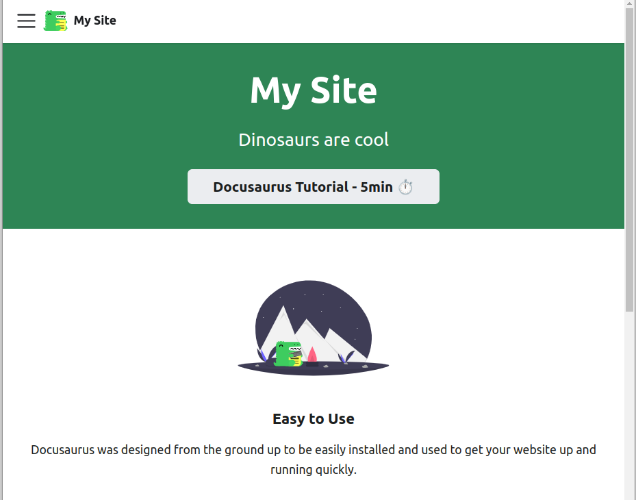
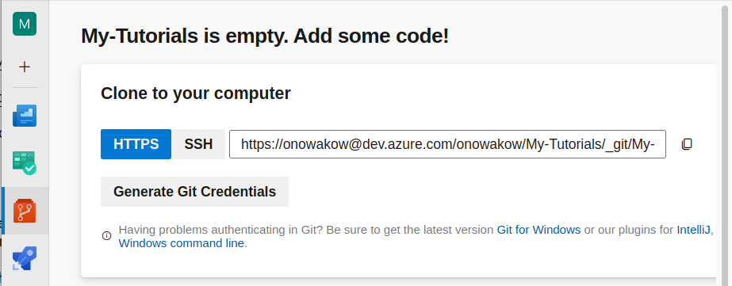
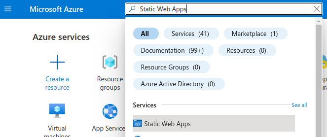
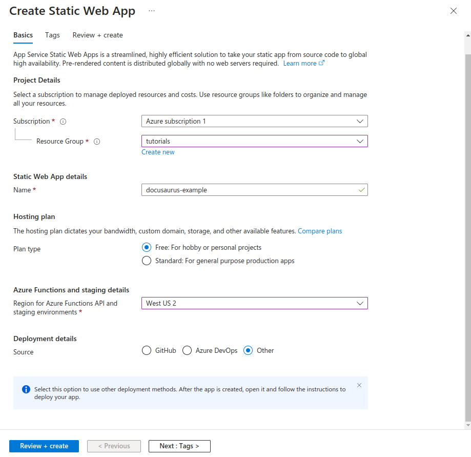
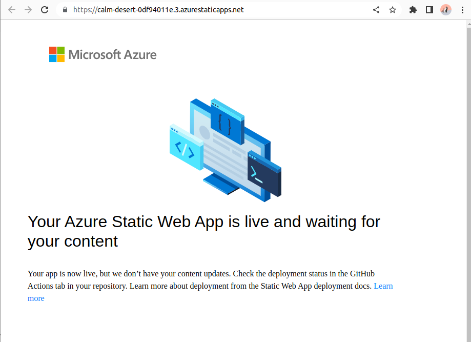
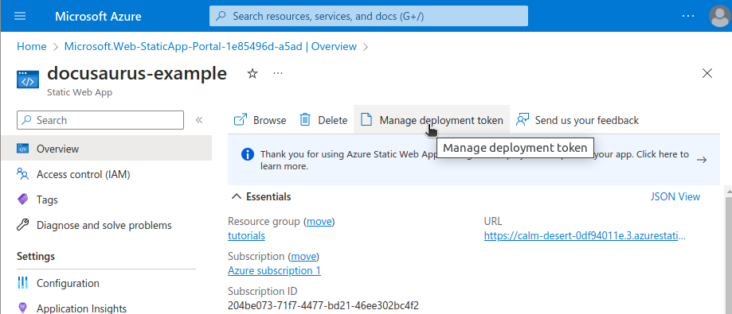

# Deploy Docusaurus to Azure Static Web Apps using Azure DevOps

Documentation is an necessary element of most projects. Facebook's open source project, [Docusaurus](https://docusaurus.io/docs), makes creating beautiful and clean documentation easy. We will deploy the docs using Azure Static Web Apps with an automatic deployment when changes are pushed to the Github repo.

These docs will assume basic knowledge of Git, Node Package Manager (npm), and markdown. Tutorials are readily available for all of these topics across the internet for the unfamiliar.

## Install Docusaurus

We will begin by creating a Docusaurus app. Official documentation for this step is available at [Docusaurus Docs: Scaffold Project Website](https://docusaurus.io/docs/installation#scaffold-project-website).

1. Navigate to a new empty directory.

2. Run the `create-docusaurus` executable via Node Package eXecute(npx) package. I will call the project `docusaurus-example`, but feel free to change the project name.

   ```
   npx create-docusaurus@latest docusaurus-example classic
   ```

   If all goes well, you should see an output similar to the following:
   ![Successful run of create-docusaurus begins with [Success] Created docusaurus-example](./media/create-docusaurus-output.png)

3. Serve the project locally. Run the `start` script to serve the docs to the default url of http://localhost:3000. You will need to navigate to the folder titled `docusaurus-example` before running the start script.

   ```
   cd docusaurus-example
   npm start
   ```

   When you open your browser to http://localhost:3000, you should see a screen like pictured below:

   

   From here, you can customize the docs to fit your needs. We will leave the docs in their default state for the purpose of this tutorial.

## Push Project to Azure DevOps

Docusaurus can be deployed from a variety of cloud repos like Github. This tutorial will use Azure DevOps so that we can make use of the Pipelines feature.

1. First, navigate to Azure DevOps at https://dev.azure.com and create a new project within your organization. If you haven't used Azure DevOps before, you may need to configure it to work with your Microsoft account. I created an organization and a new project called "tutorials".

2. Go to Repos in the sidebar. You should see a message like "Tutorials is empty. Add some code." Copy the HTTPs link and save it for later. We will use the "Generate Git Credentials" button later.

   

3. Initialize an new git repo in the parent folder of your docusaurus project. For example, if your docusaurus project is at /documents/docs-project/docusaurus-example, initialize the repository in docs-project. This will help us later when we add a builds folder to house the pipeline files.

   **a**. Initialize a repo and add your Docusaurus files:

   ```
   git init
   git add .
   ```

   **b**. Make your initial commit:

   ```
   git commit -m "Create new docusaurus project"
   ```

   **c**. Rename the default branch from "master" to "main". This step is not necessary, but some developers prefer it

   ```
   git branch -M main
   ```

   **d**. Add the Azure DevOps repo as your remote repository. For this step, paste your HTTPS link from the Azure DevOps Repo page as shown in step 2 of this section:

   ```
   git remote add origin https://onowakow@dev.azure.com/onowakow/My-Tutorials/_git/My-Tutorials
   ```

   **Your IDE should prompt you for a password.** This password is found by clicking "Generate Git Credentials" in your Azure DevOps Repo.

   **Note**: "origin" is the default name for a remote repo in git. Feel free to name it whatever is appropriate, but know that certain git command shortcuts may not work.

   **e**. Push your changes:

   ```
   git push origin main
   ```

   Now that we have a local and remote repo set up, we can create a static web app.

## Configure a Static Web App

1. Navigate to the Azure Portal at https://portal.azure.com/ and create an account if you don't already have one. You can create an account for free and get $200 promotional credit following this Microsoft link https://azure.microsoft.com/en-us/free/. Azure Static Web Apps have a great hobby tier that is always free (as of May 2023).

2. In the top search bar of the Azure Portal, search for and select Static Web Apps. Click the button to "Create Static Web App".

   

3. Fill out the form to create a static web app. The JSON and screenshot below show how I populated the form.

   Your details may be different to match your subscription, resource group, web app name, etc. If you don't have a resource group, make one.

   **Note**: Resource groups are a way to group resources with shared permissions and policies.

   ```json
   {
     "Subscription": "Azure subscription 1",
     "Resource Group": "tutorials",
     "Name": "docusaurus-example",
     "Hosting plan": "Free",
     "Azure Functions and staging details": "West US 2",
     "Deployment details": "other"
   }
   ```

   

   Notice how we set the `Deployment details` to `Other`. This section can be configured to deploy your app upon pushing to a remote repository. We want to set up a pipeline to build and configure the app prior to deploying it, so **do not select `Azure DevOps`**.

   Finally, click `Review and Create`, confirm the details, and select `Create`.

   To confirm that your app is running, go to the resource, and in the Overview tab, go to the static web app URL. The app should show that it is running.

   

4. Get deployment details. Navigate to your static web app in the Azure Portal. In the Overview tab, select `Manage Deployment Token`.

   

   Copy the deployment token value into a safe place for the pipeline step.

## Create a Build Pipeline

We will write a simple pipeline using YAML, and import the YAML into Azure DevOps. Do not worry if you are unfamiliar with YAML. You will see that YAML is fairly easy to work with.

1. In your docusaurus parent folder, create a folder called `builds`. Your repo should now have two folders: one for the Docusaurus project (perhaps called 'docusaurus-example') and one for builds called 'builds'.

2. Create a file called `build-and-deploy.yaml`. The name can be whatever suits your project. The code will be followed by an explanation of the fields.

   In `build-and-deploy.yaml`, add the following code, making changes to suit your project:

   ```yaml
   trigger: none

   pool:
     vmImage: ubuntu-latest

   steps:
     - task: AzureStaticWebApp@0
       inputs:
         app_location: docusaurus-example
         app_build_command: npm run build
         output_location: build
   ```

   **trigger**: For now, we will manually trigger the pipeline. We could also trigger the pipeline automatically (continuous integration style) like the following code block:

   ```yaml
   trigger:
     branches:
       include:
         - main
       paths:
         include:
           - docusaurus-example/*
   ```

   **vmImage**: The virtual machine image tells the pipeline which virtual machine to run on. The `AzureStaticWebApp@0` task requires `ubuntu-latest`.

   **app_location**: The location of the app's root relative to the repository. If the project was in the app root, the app_location would be ''

   **app_build_command**: The `AzureStaticWebApp@0` task is wonderful because it automatically builds the app. `app_build_command` allows for a custom build command. We know that Docusaurs are build with `npm run build` because the script is specified in the `package.json` file.

   **output_location**: `output_location` is relative to the `app_location` and not to the root. By default, Docusaurus will build to the `build` folder.

   Also see: [AzureStaticWebApp@0 Task Docs](https://learn.microsoft.com/en-us/azure/devops/pipelines/tasks/reference/azure-static-web-app-v0?view=azure-pipelines)

Return to Azure DevOps and click on the Repos icon. We will use

Select Use the classic
