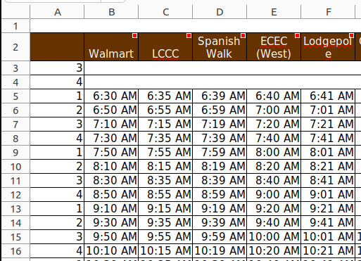
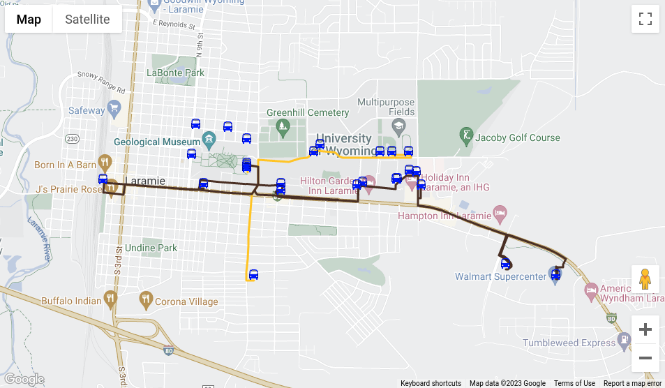
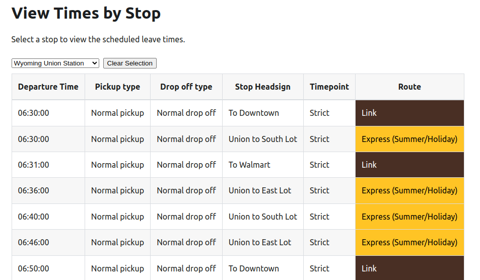

# Creating a GTFS Dataset

I spent the past couple of weeks developing a GTFS dataset for University of Wyoming to publish their transit data on Google Maps. This post is a brief overview of the project, and more detailed information can be found in the **Projects** tab of this blog, or at [Introduction to the General Transit Feed Specification](/docs/GTFS/introduction).

## Motivation

With this new blog, I needed some projects to write about. Being a bus driver for UWYO, publishing their data to Google Maps is something I've been wanting to do for a while. In fact, last year I spent months developing an awesome full-stack web app for creating and publishing route timetables called _SmallTown Transit_.

The app ended up being a never-ending project and was a huge lesson in Agile development (Check out the [Agile Manifesto](https://agilemanifesto.org/) if you are unfamiliar with Agile).

I aimed in this project to have a shippable product in two weeks, and that's what I did.

## Outline

1. **Clean the existing timetables.** UWYO's timetables are Excel documents that are made to be human-readable. I created standardized CSV documents where every cell is plain text because this would be easier to manage with Python.

2. **Write a Python script** for creating the feed. Some of the txt files in the feed are manually created, while others like **trips.txt**, **stop_times.txt**, and **shapes.txt** lend themselves to being programmatically generated.

3. **Create a quick React app** to view and check the data for accuracy. Using the **Google Maps API**, I am able to view the stop locations and route shapes.

## Cleaning the Timetables

I started the project with timetables from the transit department. These show a leave time for every bus stop along a route.

### The original tables

In the original timetables columns are _stops_ ('Downtown' and 'East Lot'), rows are _trips_ (one lap around a route), and cells are _stop times_ ('6:30 AM at Downtown'). See the picture below.

These provided timetables are great for human readability as well as recalculating times. The cells are variously colored, merged, and contain plain text, numbers, and calculations.

**I needed to:**

1. Flatten these tables into standard, 100% plain text CSV files.
2. Replace stop names ('Walmart') with stop IDs ('WM') so that I could reference a **stops.txt** table.
3. Add information about stop types (ie. can passengers board here? Do passengers need to notify the driver to stop here?). This required insight into how the department and routes work, as this information is not included in their timetables.

### The formatted table

<table>
  <thead>
    <tr>
      <th>WM</th>
      <th>LCCC</th>
      <th>SPW</th>
      <th>ECEC</th>
      <th>...</th>
    </tr>
  </thead>
  <tbody>
    <tr>
      <td>06:30:00</td>
      <td>06:35:00</td>
      <td>06:39:00</td>
      <td>
        06:40:00<b>?</b>
      </td>
      <td>...</td>
    </tr>
    <tr>
      <td>06:50:00</td>
      <td>06:55:00</td>
      <td>06:59:00</td>
      <td>
        06:40:00<b>?</b>
      </td>
      <td>...</td>
    </tr>
    <tr>
      <td>...</td>
      <td>...</td>
      <td>...</td>
      <td>...</td>
      <td>...</td>
    </tr>
  </tbody>
</table>

The **exclamation mark** designate a **stop request**: A stop where passengers must get the driver's attention (typically by pulling the stop request cord).

I likewise used the **question mark** and **pipe** to designate an interpolated timepoint and a do-not-board stop respectively.

More symbols could be added, but these few allowed for the layers of information I needed.

## Writing a Python Script

I chose to use Python to create the GTFS feed. I used a Jupyter Notebook for quick development and integrated documentation.

The main purpose of the Python script is to convert formatted timetables to the CSV files required by the GTFS. The below tables demonstrates the transition from timetable to stop_times and trips. The tables are simplified versions of the files required by GTFS. Notice how each timetable row gets a row in **trips.txt** and each cell gets a row in **stop_times.txt**

### Python script input (simplified)

**link_timetable.csv**

<table>
  <thead>
    <tr>
      <th>WM</th>
      <th>UN</th>
      <th>DTN</th>
      <th>UN</th>
      <th>WM</th>
    </tr>
  </thead>
  <tbody>
    <tr>
      <td>06:30:00</td>
      <td>06:45:00</td>
      <td>07:00:00</td>
      <td>07:15:00</td>
      <td>07:30:00</td>
    </tr>
    <tr>
      <td>07:30:00</td>
      <td>07:45:00</td>
      <td>08:00:00</td>
      <td>08:15:00</td>
      <td>08:30:00</td>
    </tr>
  </tbody>
</table>

### Python script output (simplified)

  

    <section style={{ marginRight: '3rem' }}>
      <b>trips.txt</b>
      <table>
        <thead>
          <tr>
            <td>route_id</td>
            <td>trip_id</td>
          </tr>
        </thead>
        <tbody>
          <tr>
            <td>L</td>
            <td>L0</td>
          </tr>
          <tr>
            <td>L</td>
            <td>L1</td>
          </tr>
        </tbody>
      </table>
    </section>
    <section>
      <b>stop_times.txt</b>
      <table>
        <thead>
          <tr>
            <th>trip_id</th>
            <th>stop_time</th>
            <th>stop_id</th>
            <th>stop_type</th>
          </tr>
        </thead>
        <tbody>
          <tr>
            <td>L0</td>
            <td>06:30:00</td>
            <td>WM</td>
            <td>0</td>
          </tr>
          <tr>
            <td>L0</td>
            <td>06:45:00</td>
            <td>UN</td>
            <td>0</td>
          </tr>
          <tr>
            <td>...</td>
            <td>...</td>
            <td>...</td>
            <td>...</td>
          </tr>
          <tr>
            <td>L1</td>
            <td>06:30:00</td>
            <td>WM</td>
            <td>0</td>
          </tr>
          <tr>
            <td>L1</td>
            <td>06:45:00</td>
            <td>UN</td>
            <td>0</td>
          </tr>
          <tr>
            <td>...</td>
            <td>...</td>
            <td>...</td>
            <td>...</td>
          </tr>
        </tbody>
      </table>
    </section>
  

### Other tasks

Beyond creating **stop_times.txt** and **trips.txt**, the Python script also handles:

1. Importing all necessary data files (**stops.xlsx**, **routes.xlsx**, **agency.xlsx**, etc.), processing data if necessary, and exporting them as **.txt** files.

2. Generate **shapes.txt** using Google Maps Directions API. **shapes.txt** is used to display a colored line for a given route on Google Maps. Directions API returns an encoded polyline which must be decoded. Luckily, there is a Python package for this.

## Creating a React App for Viewing and Verifying GTFS

The React App I built can be found on this site at the [GTFS Viewer](/docs/GTFS/gtfs-viewer). If you don't have a GTFS feed, look at the screenshots below from the GTFS Viewer. For the app, I used MDX, the combination of markdown and JSX that allows for directly using React components in markdown files.

### Viewing route shapes and stop locations

### Viewing stop times by stop

This app ended up being helpful not only for viewing and verifying data, but also showing the transit agency their data in a way that is easy to visualize.
