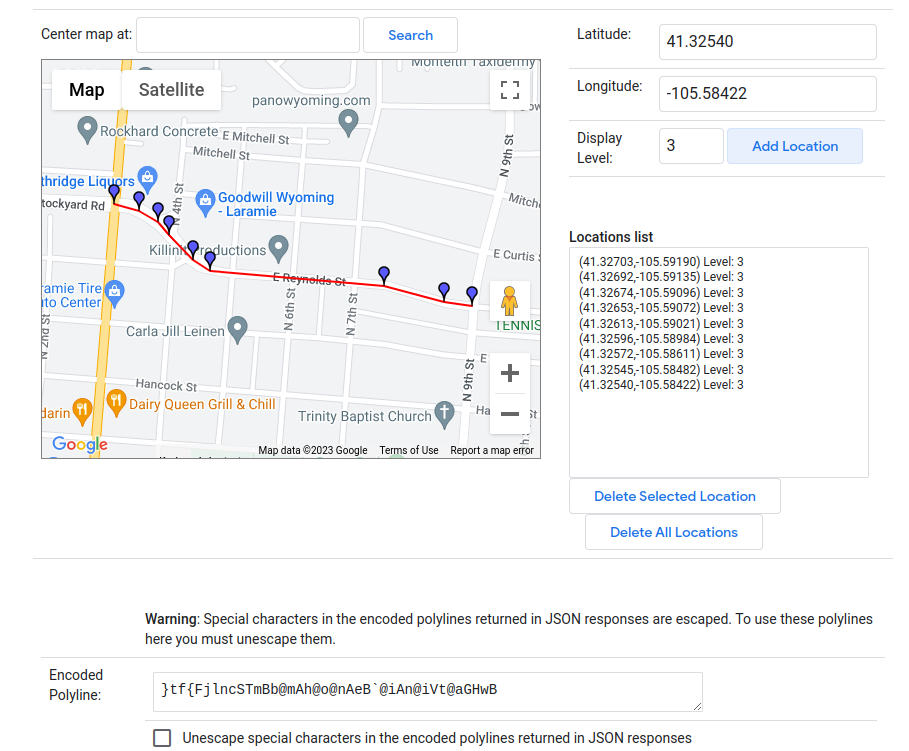

# Creating shapes.txt with Google Maps API

Transit agencies can share route information via the standardized General Transit Feed Spec (GTFS), a series of CSV files. Parts of this specification would be laborious to create without the help of automation. `shapes.txt` is a file that draws out route paths.

My goal was to generate this file using the Google Maps API and Python. The result is not always perfectly representative of the path a bus actually takes, but I found that it is close enough for my purposes.

## Google Maps Polylines

The essence of `shapes.txt` are polylines, or lists of coordinates that draw out a route's path.

These polylines can be automatically generated using the Google Maps API. The Google Maps [Directions API](https://developers.google.com/maps/documentation/directions/overview) will return an encoded polyline like `}tf{FjlncSTmBb@mAh@o@nAeB@iAn@iVt@aGHwB` that we can use Python to decode into a list of coordinates.

You can experiment with creating polylines with the [Google Maps Polyline Utility](https://developers.google.com/maps/documentation/utilities/polylineutility). Below shows a small polyline I created with the utility to demonstrate what a shape is:



I wanted to generate polylines using a list of stops, like "Union --> Downtown --> Walmart". I joined these stops with a list of stop coordinates, ran the list through the Directions API, and finally created the `shapes.txt` file.

## Prepping the waypoint list

In Google Maps [Directions API](https://developers.google.com/maps/documentation/directions/overview), you can ask for directions from an **origin** to a **destination** with a list of **waypoints**. At the top of my raw route timetables (CSV), I had a series of stop IDs like:

<table>
  <tbody>
    <tr>
      <td>SEL</td>
      <td>UN_3</td>
      <td>AA</td>
      <td>EL_1</td>
      <td>EL_2</td>
      <td>EL_3</td>
      <td>ANML</td>
      <td>UN_2</td>
      <td>SEL</td>
    </tr>
  </tbody>
</table>

My Stops table housed a list of stops with stop IDs and latitude-longitude locations. I looped through the stop IDs and crossed this information with the stops table, creating a list of waypoints. I used the Python Client for Google Maps Services library, and chose to use tuples for the waypoints in accordance with the [Directions Docs](https://googlemaps.github.io/google-maps-services-python/docs/index.html#googlemaps.Client.directions).

```python
all_waypoints = [
    (41.3021632, -105.540547),
    (41.303224, -105.546676),
    (41.3104826, -105.5570798),
    (41.311719, -105.557704),
    (41.311098, -105.560157),
    (41.310502, -105.564956),
    (41.310026, -105.574351),
    (41.312475, -105.578491),
    (41.31063, -105.583832) ...
]
```

The final thing to note is that Directions API expects an origin, a destination, and the in-between waypoints. I sliced the `all_waypoints` list into these three parameters and assigned them to their route.

```python
route.first_stop = route.all_waypoints[0]
route.final_stop = route.all_waypoints[-1]
route.waypoints = route.all_waypoints[1:-1]
```

## Creating the latitude-longitude polyline

I used the Python Client for Google Maps Services library to easily make calls to the Directions API. You will need to install the client library and configure an API key through Google. You will have to give Google your payment information, and information on pricing can be found at [Google Maps Platform Pricing](https://mapsplatform.google.com/pricing/). Google currently refunds $200 each month, so I have never had to pay for using the API.

Please research best practices for storing and restricting your API key to avoid excess or unauthorized resource consumption.

Here are a few helpful resources:

- [Python Client for Google Maps Services](https://github.com/googlemaps/google-maps-services-python)
- [Google Directions API Overview](https://developers.google.com/maps/documentation/directions/overview)
- [Creating a Google Maps API Key](https://developers.google.com/maps/documentation/javascript/get-api-key)

Creating the polyline has three main steps:

1. Call the Directions API. I stored the Google Maps API Key as an environmental variable. Storing the API key in your source code is unwise unless you have adequate restrictions on the use of the key.

   ```python
   import googlemaps

   # Instantiate Google Maps Client
   gmaps = googlemaps.Client(key=os.getenv("GOOGLE_MAPS_API_KEY"))

   # Call Directions API.
   # origin and destination are lat-lng tuple
   # waypoints are lat-lng tuple list
   directions_response = gmaps.directions(
       origin=origin, destination=destination, mode="driving", waypoints=waypoints
   )
   ```

2. Decode encoded polyline. I used this [Polyline Decoder library](https://pypi.org/project/polyline/). Note that the client returns an array of directions. This is because the API can be configured to return multiple direction options.

   ```python
   import polyline

   directions = directions_response[0]
   directions_polyline = directions["overview_polyline"]["points"]
   shape = polyline.decode(directions_polyline)
   ```

3. Create a latitude-longitude polyline

   ```python
   latLngPolyline = []

   for point in shape:
       latLng = {"lat": point[0], "lng": point[1]}
       latLngPolyline.append(latLng)

   return latLngPolyline
   ```

## Create shapes.txt

The final step was to take the polyline data and create `shapes.txt`. In the General Transit Feed Spec, `shapes.txt` defined the path taken by a route. This helps Google Maps and other applications display a line for users to get an idea of where a route runs. See the [Google GTFS Reference on shapes.txt](https://developers.google.com/transit/gtfs/reference#shapestxt) for more information.

The below function creates a route's shape dataframe. I needed to create a shape dataframe for each route, and then combine the dataframes into one.

```python
def createShapeDf(latLngPolyline, route_id):
    shape_df = pd.DataFrame(
        columns=["shape_id", "shape_pt_lat", "shape_pt_lon", "shape_pt_sequence"]
    )
    shape_id = route_id

    for index, point in enumerate(latLngPolyline):
        shape_pt = {
            "shape_id": shape_id,
            "shape_pt_lat": point["lat"],
            "shape_pt_lon": point["lng"],
            "shape_pt_sequence": index,
        }
        shape_df.loc[len(shape_df.index)] = shape_pt

    return shape_df
```

**Note on dataframes**: Pandas dataframes can be converted into a CSV like shown below.

```python
df.to_csv(path, index=False)
```

## Final thoughts
